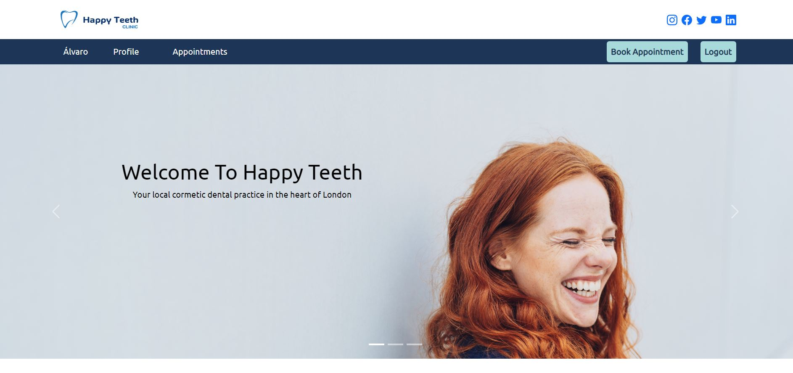
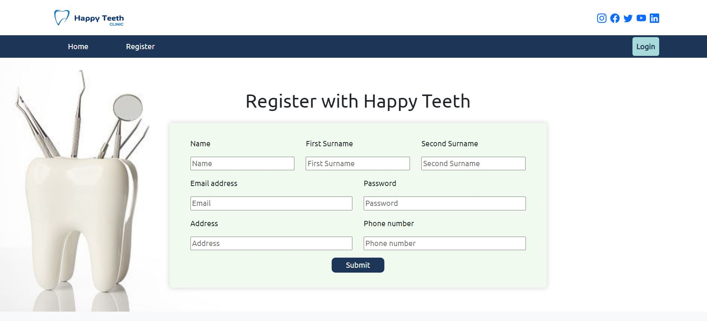
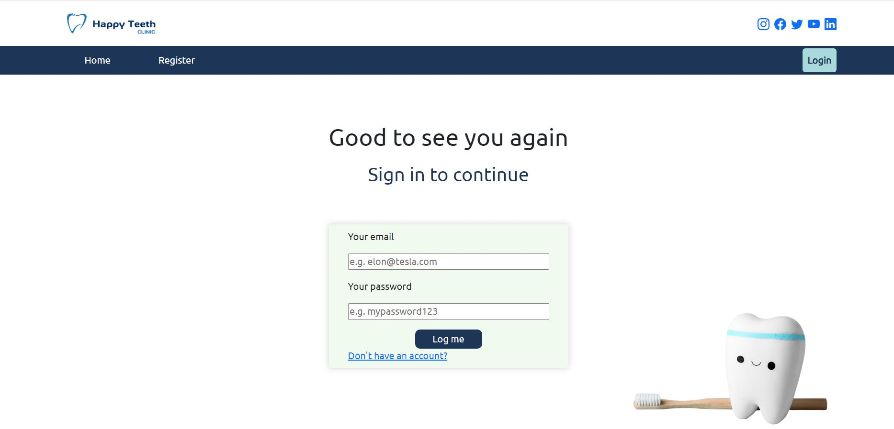
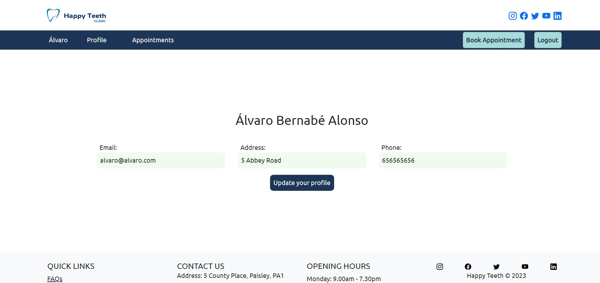
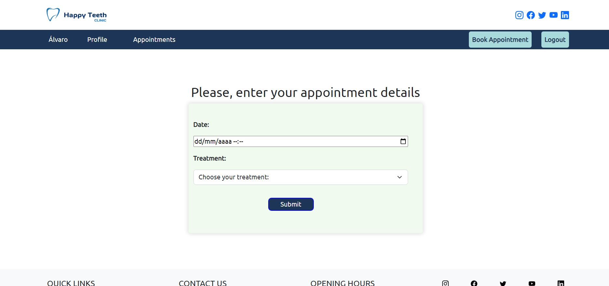
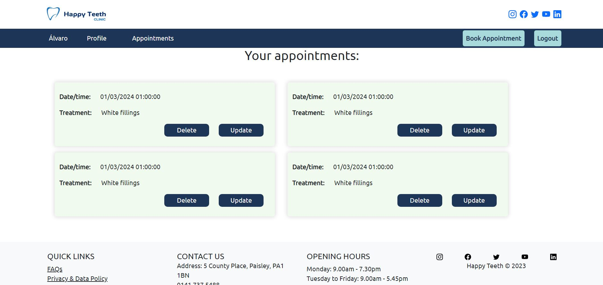
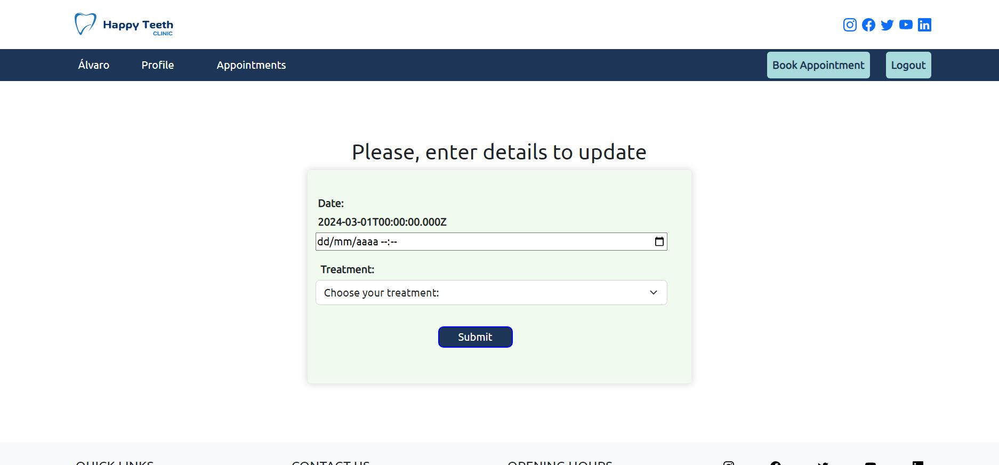
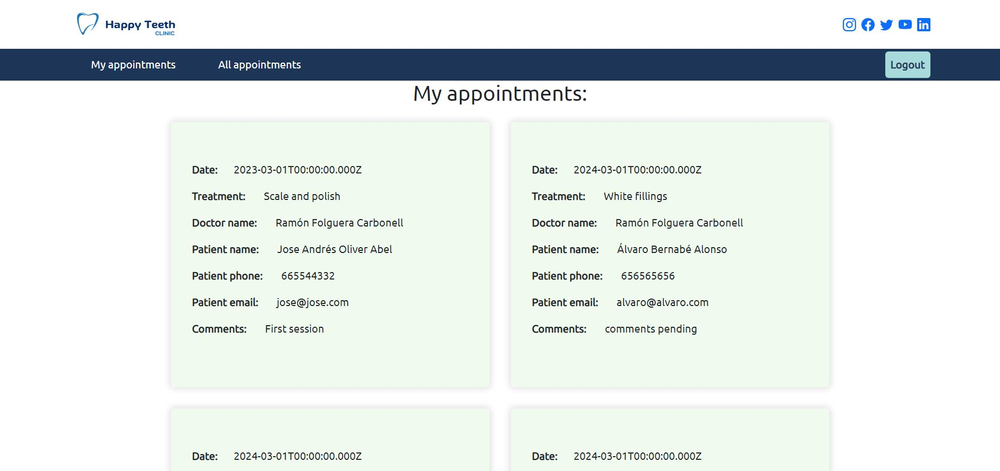
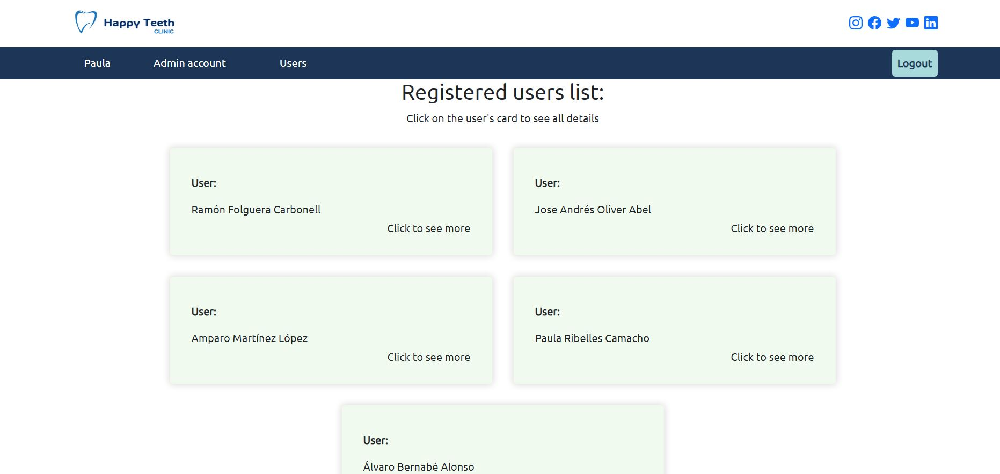

# Welcome to my frontend app - Happy Teeth Dental Practice 

<details>
  <summary>Content 📝</summary>
  <ol>
    <li><a href="#objetivo-🎯">Goals</a></li>
    <li><a href="#sobre-el-proyecto-🔎">About</a></li>
    <li><a href="#deploy-🚀">Deploy</a></li>
    <li><a href="#stack">Stack</a></li>
    <!-- <li><a href="#instalación-en-local">Installation</a></li> -->
    <li><a href="#vistas">Pages</a></li>
    <li><a href="#futuras-funcionalidades">Future functionalities</a></li>
    <!-- <li><a href="#contribuciones">Contributions</a></li> -->
    <li><a href="#licencia">License</a></li>
    <li><a href="#webgrafia">Webography</a></li>
    <li><a href="#desarrollo">Development</a></li>
    <li><a href="#agradecimientos">Thanks</a></li>
    <li><a href="#contacto">Contact</a></li>
  </ol>
</details>

## Goal 🎯
In this second part, we needed for this project to use react to create a web and connect to our functional API.

## About 🔎
We continue working creating our Dental Practise web application. I worked on getting all those endpoints we worked on the backend side to perfectly function on the frontend side. To do so I needed for the web to let users to register, login, book appointments, delete appointments, update appointments, update their user profiles, ... etc.. And acces the web with different roles: doctor, client and admin.
  
## Deploy 🚀
<div align="center">
    <a href="https://fedramon.d1rways0eyajks.amplifyapp.com/"><strong>Url to my Dental Practise Web Application </strong></a>🚀🚀🚀
</div>

## Stack
<div align="center">
<a href="https://www.reactjs.com/">
    
</a>
<a href="https://developer.mozilla.org/es/docs/Web/JavaScript">
    
</a>
<a href="https://railway.com/">
    
</a>
<a href="https://developer.mozilla.org/es/docs/Web/CSS">
    
</a>
<a href="https://www.w3schools.com/html/">
    
</a>
<a href="https://react-bootstrap.github.io/">
    
</a>
<a href="https://git-scm.com/">
    
</a>
<a href="https://nodejs.org/en">
    
</a>
<a href="https://nodejs.org/en">
    
</a>
<a href="https://nodejs.org/en">
    
</a>
</div>

<!-- ## Local installation
To be able to see how it works for yourself on your local computer, please follow next steps:
1. Copy the repository url and clone it on your computer with git bash: 
 ```
$git clone https://github.com/RamonFolguera/rfc-geekshubs-fsd-val-project5-26032023.git
 ```
2. Install all dependencies with: ` $ npm install `
3. ``` $ npm run dev ```
4. ... -->

## Pages
Landing
  
Register

Login

Profile

Book Appointment

Your appointments as client

Update your selected appointment

Get list of appointments as doctor

Get all registered users as admin


## Future functionaly
⬜ Search and filter tool to find a user or an appointment
⬜ Add a Superadmin role able to assign roles to our users

<!-- ## Contributions
Suggestions and contributions are more than welcomed.  

Puedes hacerlo de dos maneras:

1. Abriendo una issue
2. Crea un fork del repositorio
    - Crea una nueva rama  
        ```
        $ git checkout -b feature/nombreUsuario-mejora
        ```
    - Haz un commit con tus cambios 
        ```
        $ git commit -m 'feat: mejora X cosa'
        ```
    - Haz push a la rama 
        ```
        $ git push origin feature/nombreUsuario-mejora
        ```
    - Abre una solicitud de Pull Request -->

## License
This project has been created under a MIT License. To learn more about the details go to LICENSE.md.

## Development:

``` js
 console.log("Developed by: " + Ramón Folguera Carbonell);
```  

## Thanks:

I want to thank my GeekHub mentors for all the support they have given us everyday:

- **Dani**  
<a href="https://github.com/Dave86dev" target="_blank"></a> 

- **Jose**  
<a href="https://github.com/JoseMarin" target="_blank"></a> 

- **David**  
<a href="https://www.github.com/userGithub/" target="_blank"></a>

- ***Mara***  
<a href="https://github.com/MaraScampini" target="_blank"></a> 

## Contact

Feel free to contact me anytime, to help you with your project with React or to give me some feedback. Happy to hear from you.

<a href = "mailto:folguera.ramon@gmail.com"></a>
<a href="https://www.linkedin.com/in/ram%C3%B3n-folguera-0ab32776/" target="_blank"></a> 
</p>
